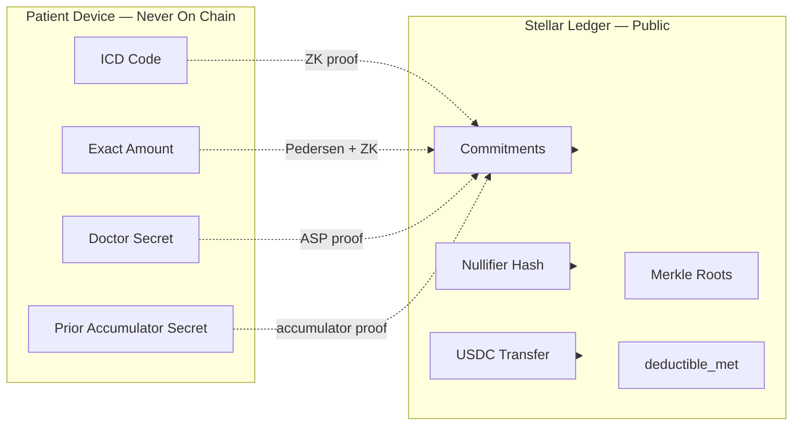
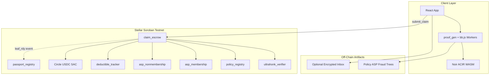
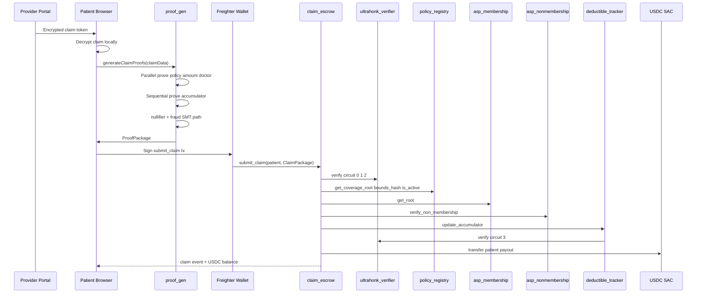
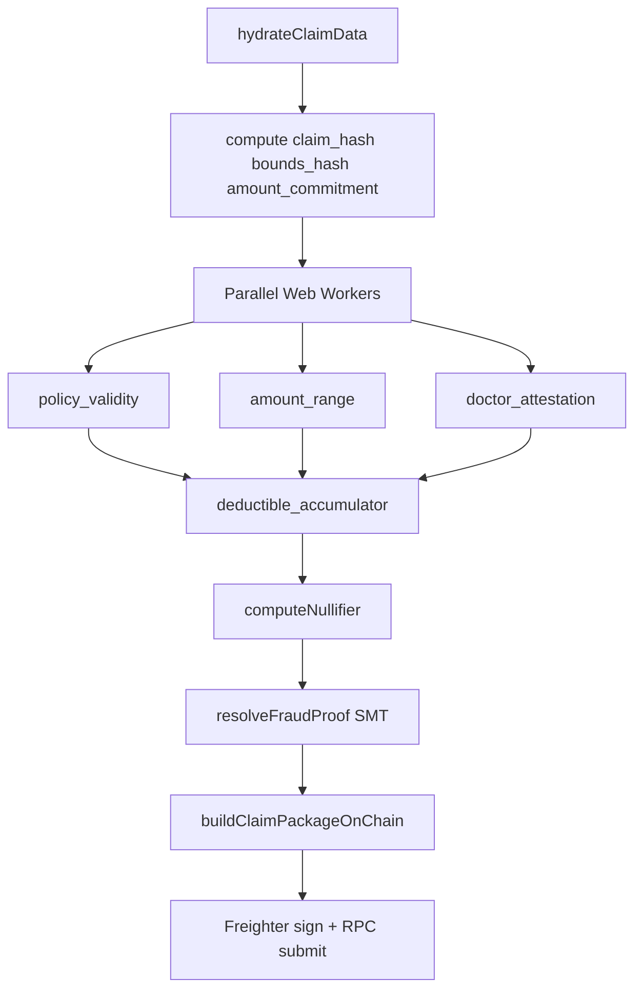
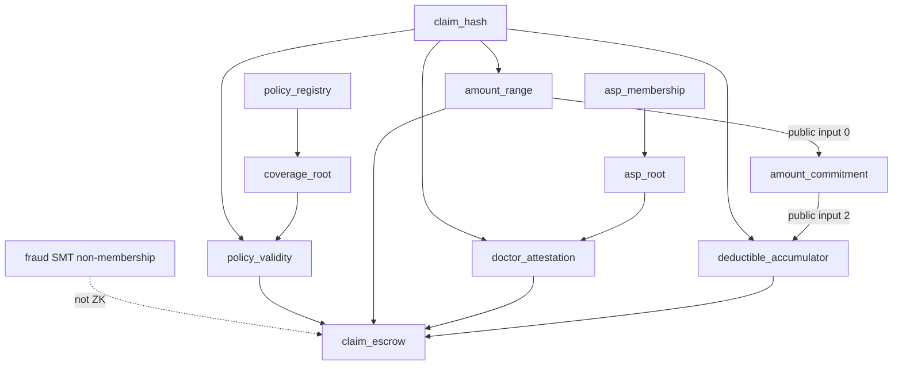
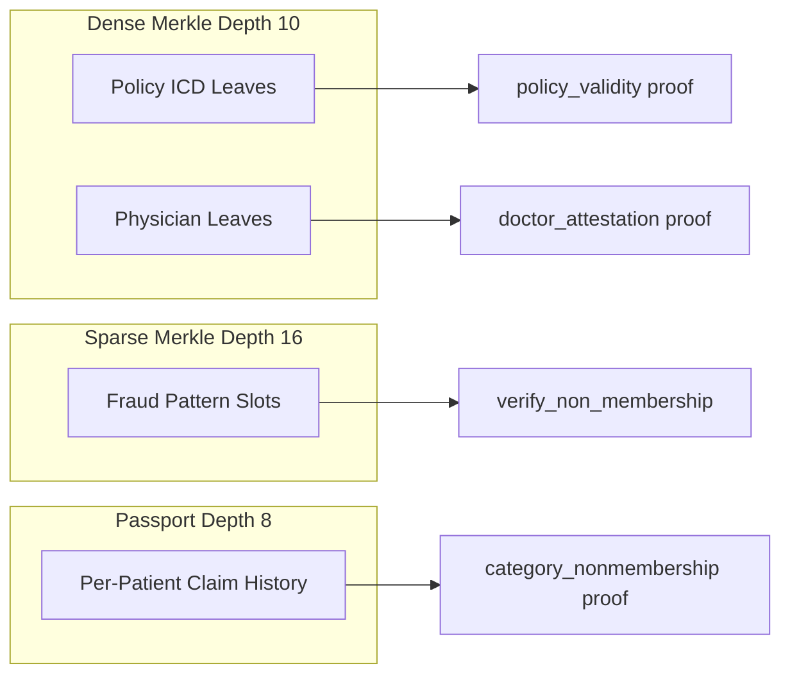
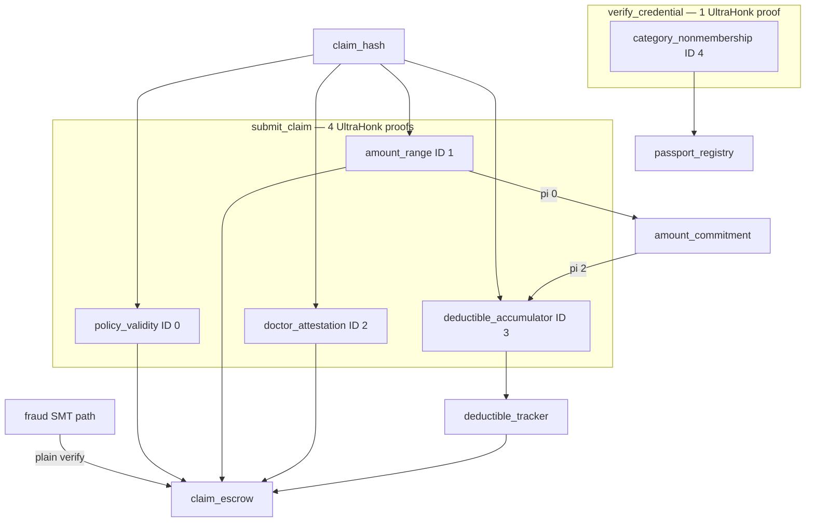
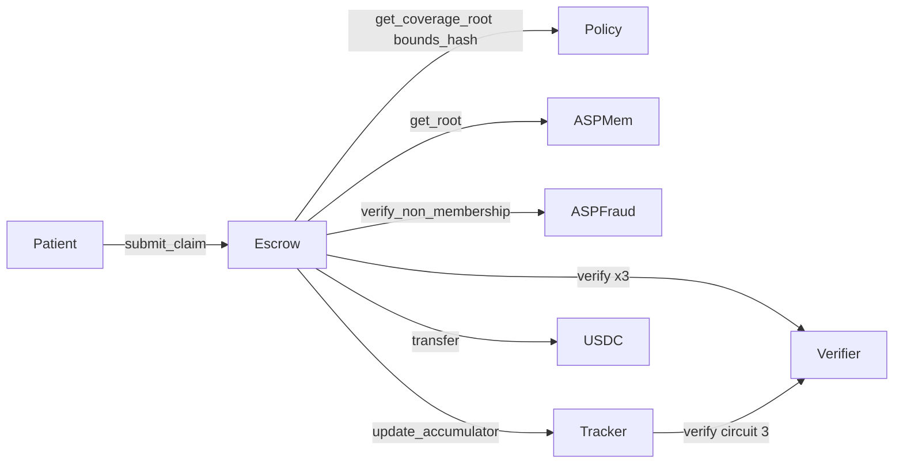

# ZKlaim

> Prove your insurance claim is valid. Receive payment. Reveal nothing about your diagnosis.

Private medical claim settlement on Stellar via Noir UltraHonk proofs, Authorized Service Provider (ASP) compliance trees, recursive deductible accumulation, and Circle USDC escrow — a compositional zero-knowledge system built for the **ZK on Stellar Hackathon** (June 2026).

**Stack:** Soroban smart contracts (Rust/WASM) · Noir 1.0.0-beta.3 · Barretenberg UltraHonk 0.87.0 · BN254 host functions (CAP-0074/0075/0080) · Stellar testnet

---

## Deployed Contracts (Stellar Testnet)

All on-chain logic lives in **seven Soroban smart contracts** (not EVM/Solidity). Each row links to [Stellar Expert](https://stellar.expert/explorer/testnet) for live contract inspection.

| Contract | Role | Circuit ID | Testnet Contract ID | Explorer |
|----------|------|:----------:|---------------------|----------|
| [`ultrahonk_verifier`](https://stellar.expert/explorer/testnet/contract/CCQIUDWBDTICZ4ACHATUVM5DXUUWULQZQTKIIVX6XX2SFVOLOQIB7OMS) | On-chain UltraHonk proof verification (BN254 pairing) | — (verifies 0–4) | `CCQIUDWBDTICZ4ACHATUVM5DXUUWULQZQTKIIVX6XX2SFVOLOQIB7OMS` | [View →](https://stellar.expert/explorer/testnet/contract/CCQIUDWBDTICZ4ACHATUVM5DXUUWULQZQTKIIVX6XX2SFVOLOQIB7OMS) |
| [`asp_membership`](https://stellar.expert/explorer/testnet/contract/CCDTCHMALRVMQ27UILI24FWMWEN2XACBLIVSJ3F5CIK4QADVPAGPX65D) | Licensed physician ASP Merkle tree (depth 10) | — | `CCDTCHMALRVMQ27UILI24FWMWEN2XACBLIVSJ3F5CIK4QADVPAGPX65D` | [View →](https://stellar.expert/explorer/testnet/contract/CCDTCHMALRVMQ27UILI24FWMWEN2XACBLIVSJ3F5CIK4QADVPAGPX65D) |
| [`asp_nonmembership`](https://stellar.expert/explorer/testnet/contract/CCZK6XRWBK2WGKU64CLSDDX2MJHWPJFW3JL3LAOUWXZFM2AZIPUWNTQY) | Fraud billing-pattern sparse Merkle blacklist (depth 16) | — | `CCZK6XRWBK2WGKU64CLSDDX2MJHWPJFW3JL3LAOUWXZFM2AZIPUWNTQY` | [View →](https://stellar.expert/explorer/testnet/contract/CCZK6XRWBK2WGKU64CLSDDX2MJHWPJFW3JL3LAOUWXZFM2AZIPUWNTQY) |
| [`policy_registry`](https://stellar.expert/explorer/testnet/contract/CDOMII7OH6ZXARIZ6O3XF4FQEX6X34OCP3ETZU7SHKILPZD4VUFYW3CT) | Per-insurer coverage roots, amount bounds, expiry | — | `CDOMII7OH6ZXARIZ6O3XF4FQEX6X34OCP3ETZU7SHKILPZD4VUFYW3CT` | [View →](https://stellar.expert/explorer/testnet/contract/CDOMII7OH6ZXARIZ6O3XF4FQEX6X34OCP3ETZU7SHKILPZD4VUFYW3CT) |
| [`deductible_tracker`](https://stellar.expert/explorer/testnet/contract/CDYEHGHRQ56CXZNGTCU6DOYSDNSRSSJ57VULQ3MS2CNYTALAV5NNZ4DY) | Per-patient private deductible accumulator state | 3 | `CDYEHGHRQ56CXZNGTCU6DOYSDNSRSSJ57VULQ3MS2CNYTALAV5NNZ4DY` | [View →](https://stellar.expert/explorer/testnet/contract/CDYEHGHRQ56CXZNGTCU6DOYSDNSRSSJ57VULQ3MS2CNYTALAV5NNZ4DY) |
| [`claim_escrow`](https://stellar.expert/explorer/testnet/contract/CCJZBRSDHBMRBUVTORJCPAD7ZU6WOFOJY5ZJG5RTA45KWK4PDCAWVGVO) | Settlement orchestrator — proofs, fraud, payout, nullifiers | 0, 1, 2 (inline) + 3 (via tracker) | `CCJZBRSDHBMRBUVTORJCPAD7ZU6WOFOJY5ZJG5RTA45KWK4PDCAWVGVO` | [View →](https://stellar.expert/explorer/testnet/contract/CCJZBRSDHBMRBUVTORJCPAD7ZU6WOFOJY5ZJG5RTA45KWK4PDCAWVGVO) |
| `passport_registry` | Per-patient claim passport + ZK credential issuance | 4 | `PASSPORT_REGISTRY_CONTRACT_ID` in `.env` (written by deploy) | [View →](https://stellar.expert/explorer/testnet/contract/) after deploy |
| Circle USDC SAC | Settlement token (7-decimal Soroban asset) | — | `CBIELTK6YBZJU5UP2WWQEUCYKLPU6AUNZ2BQ4WWFEIE3USCIHMXQDAMA` | [View →](https://stellar.expert/explorer/testnet/contract/CBIELTK6YBZJU5UP2WWQEUCYKLPU6AUNZ2BQ4WWFEIE3USCIHMXQDAMA) |

**Classic USDC issuer (testnet):** `GBBD47IF6LWK7P7MDEVSCWR7DPUWV3NY3DTQEVFL4NAT4AQH3ZLLFLA5`

**Transaction explorer pattern:** `https://stellar.expert/explorer/testnet/tx/{hash}`

---

## Table of Contents

1. [Introduction](#introduction)
   - [What ZKlaim Is](#what-zklaim-is)
   - [The Privacy Boundary](#the-privacy-boundary)
   - [Technical Innovations](#technical-innovations)
2. [The Problem](#the-problem)
   - [Medical Privacy Is Broken Everywhere](#medical-privacy-is-broken-everywhere)
   - [Why Existing Approaches Fail](#why-existing-approaches-fail)
   - [The Gap ZKlaim Fills](#the-gap-zklaim-fills)
3. [The Solution](#the-solution)
   - [Patient Experience](#patient-experience)
   - [Cryptographic Guarantees](#cryptographic-guarantees)
   - [What ZKlaim Does Not Do](#what-zklaim-does-not-do)
   - [Why Stellar Is Load-Bearing](#why-stellar-is-load-bearing)
   - [Nullifiers and Double-Spend Prevention](#nullifiers-and-double-spend-prevention)
4. [Architecture](#architecture)
   - [Layered System Design](#layered-system-design)
   - [End-to-End Claim Sequence](#end-to-end-claim-sequence)
   - [Proof Generation Pipeline](#proof-generation-pipeline)
   - [Public Input Chaining](#public-input-chaining)
   - [Merkle Tree Taxonomy](#merkle-tree-taxonomy)
   - [Coordination Layer](#coordination-layer)
5. [Circuit Explanation](#circuit-explanation)
   - [Cryptographic Primitives](#cryptographic-primitives)
   - [Circuit Registry](#circuit-registry)
   - [policy_validity (Circuit 0)](#policy_validity-circuit-0)
   - [amount_range (Circuit 1)](#amount_range-circuit-1)
   - [doctor_attestation (Circuit 2)](#doctor_attestation-circuit-2)
   - [deductible_accumulator (Circuit 3)](#deductible_accumulator-circuit-3)
   - [category_nonmembership (Circuit 4)](#category_nonmembership-circuit-4)
   - [Circuit Composition](#circuit-composition)
6. [Contract Explanation](#contract-explanation)
   - [ultrahonk_verifier](#ultrahonk_verifier)
   - [asp_membership](#asp_membership)
   - [asp_nonmembership](#asp_nonmembership)
   - [policy_registry](#policy_registry)
   - [deductible_tracker](#deductible_tracker)
   - [claim_escrow](#claim_escrow)
   - [passport_registry](#passport_registry)
   - [ClaimPackage Wire Format](#claimpackage-wire-format)
7. [Conclusion](#conclusion)

---

## Introduction

### What ZKlaim Is

ZKlaim is a **zero-knowledge insurance claim settlement system** built entirely on the Stellar blockchain. An insured patient submits a medical claim and receives a USDC reimbursement in a single Soroban transaction — without the blockchain, the insurer's operations team, or any third party learning the patient's diagnosis, treating physician, or exact billed amount.

The surface is a **Submit Claim** button. The depth is a composition of every zero-knowledge primitive Stellar has introduced across Protocols 22, 25 (X-Ray), and 26 (Yardstick):

- **BN254 elliptic curve host functions** for on-chain UltraHonk verification
- **Poseidon2** (CAP-0075) for Merkle trees aligned across Noir, TypeScript, and Soroban
- **Pedersen commitments** on BN254 for amount hiding
- **Five Noir circuits** composed in one transaction (four for claim settlement, one for health passport credentials)
- **Two ASP trees** — membership for licensed physicians, sparse non-membership for fraud patterns
- **A recursive deductible accumulator** — private running state across multiple claims within a policy year

This is not a privacy pool with insurance branding. It is the first Stellar-native system that simultaneously proves:

1. The diagnosis is covered under a real insurer policy
2. The amount falls within policy bounds
3. A licensed physician attested the claim
4. The patient's deductible state transitioned correctly
5. The billing pattern is not on a known fraud blacklist

…while revealing **none** of the underlying medical data on-chain.

### The Privacy Boundary

ZKlaim's threat model distinguishes sharply between what the ledger must see to settle fairly and what must never leave the patient's device.

| Data element | On-chain visibility | Where it lives |
|--------------|--------------------:|----------------|
| ICD-10 diagnosis code | **Never** | ZK witness only (`policy_validity` circuit) |
| Exact claim amount (cents) | **Never** | Pedersen commitment + ZK witness (`amount_range`) |
| Physician identity / license | **Never** | ASP membership witness (`doctor_attestation`) |
| Prior claim amounts (history) | **Never** | Accumulator secret in witness (`deductible_accumulator`) |
| `claim_hash` | Public (field element) | Binds all four claim circuits to one visit |
| `policy_commitment` | Public | Proves coverage without revealing ICD code |
| `amount_commitment` | Public | Hides amount; proves range only |
| `doctor_commitment` | Public | Hides identity; proves ASP membership |
| `attestation_hash` | Public | Binds doctor signature to this claim |
| Coverage / ASP / fraud Merkle roots | Public | Registry state anchors |
| Nullifier | Public | Prevents double-claiming same visit |
| `billing_pattern_hash` | Public | Coarse fraud fingerprint (category + bucket, not diagnosis) |
| `deductible_met` flag | Public (1 byte in field) | Triggers payout formula change |
| Accumulator commitments | Public | Running state — not individual amounts |
| USDC payout amount | Public | Settlement value (coinsurance-adjusted if deductible not met) |

An observer watching the insurer's Stellar address sees a USDC outflow and a nullifier. They do **not** see a diagnosis code, a doctor name, or a line-item medical bill. The payout amount alone cannot be inverted to a diagnosis — multiple ICD codes and providers can produce identical reimbursement amounts within the same policy band.



### Technical Innovations

**1. Composable multi-circuit settlement in one Soroban transaction**

Four independent Noir circuits (`policy_validity`, `amount_range`, `doctor_attestation`, `deductible_accumulator`) are proven client-side and verified on-chain in a single `submit_claim` invocation. Their public inputs chain through a shared `claim_hash` and a shared `amount_commitment`. No prior Stellar project has demonstrated this composition pattern for domain-specific validity proofs.

**2. Recursive private deductible accumulator**

Health insurance deductibles require tracking a running total across claims. On a public chain, storing claim amounts leaks medical spending patterns. ZKlaim stores only **Poseidon commitments** to accumulator state on-chain; each claim includes a state-transition proof that the new commitment is `Poseidon2(prev_secret, new_amount, blinding)` and that `prev_secret + new_amount` crosses (or does not cross) the deductible threshold. The contract never learns individual claim amounts — only whether the threshold was met.

**3. ASP professional licensing tree**

Nethermind's Privacy Pools ASP architecture is repurposed: instead of financial compliance allow-lists, `asp_membership` holds a Poseidon Merkle tree of licensed physician credential commitments. A doctor proves membership without revealing identity — the first application of ASP trees to professional credentialing on Stellar.

**4. Fraud prevention without surveillance**

`asp_nonmembership` implements a **depth-16 sparse Merkle tree** of known fraudulent billing patterns. Honest patients prove **non-membership** of their coarse billing fingerprint without revealing diagnosis. The fraud check uses plain Merkle verification (not ZK) — cheap on-chain, zero surveillance of legitimate claims.

**5. Health Passport selective disclosure**

After settlement, patients append leaves to a per-patient passport tree and can issue **category non-membership credentials** (Circuit 4) — e.g., proving "I have no mental-health-category claims in my history" without revealing any individual claim.



---

## The Problem

### Medical Privacy Is Broken Everywhere

Health insurance is one of the most financially significant interactions a person has with any institution. Filing a claim traditionally means disclosing a diagnosis to an employer-contracted insurer whose records are accessible to underwriters, actuarial teams, re-insurers, and increasingly data brokers. The patient wanted reimbursement — not enrollment in an information economy they never consented to.

Blockchain makes this **dramatically worse**, not better. On a public ledger, a payment from an insurer wallet to a patient wallet is permanently visible, timestamped, and amount-tagged. Anyone who knows the patient's wallet address — an employer, an exchange that performed KYC, anyone who received a payment from them — can observe every insurance settlement.

The diagnosis is not on-chain, but the **pattern** is highly revealing:

| Scenario | What an observer infers without a diagnosis code |
|----------|--------------------------------------------------|
| Cancer patient receives $12,400 USDC from insurer | Something serious happened — amount band suggests major procedure |
| Mental health patient receives three $800 settlements over six months | Regular therapy cadence — trivially identifiable pattern |
| Chronic condition patient receives monthly settlements | Regularity alone discloses ongoing treatment |

**Colonial Pipeline's 2023 breach** exposed 140 million claim records. Centralized portals are centralized breach surfaces. The problem is not merely "put it on a private blockchain" — consortium chains give insurers privacy from each other but not from themselves. Patient data remains fully visible to the platform operator.

### Why Existing Approaches Fail

| Approach | Privacy model | Domain validity | Verdict |
|----------|---------------|-----------------|---------|
| Traditional insurer portals | Centralized, breachable | Full disclosure required | Broken |
| Private consortium (Hyperledger, Corda) | Insurer-to-insurer | Patient data visible to platform | Insufficient |
| ZK mixers (Tornado Cash pattern) | Breaks payment link | Cannot prove legitimate claim | Fraud vector |
| Nethermind PoolStellar | Private USDC transfer | No insurance domain logic | Foundation only |
| Simple on-chain reimbursement | Full transparency | Validity checks require disclosure | Anti-privacy |

**PoolStellar** proves that private value transfer on Stellar is feasible. It does not prove that a transfer satisfies insurance policy conditions — valid ICD coverage, authorized provider, amount within bounds, deductible state. **Tornado Cash** breaks the link between sender and receiver but cannot distinguish a legitimate pneumonia claim from a fabricated one.

### The Gap ZKlaim Fills

There is no system on any blockchain that can simultaneously prove:

- **(a)** This claim is valid under a real policy
- **(b)** This provider is licensed
- **(c)** This amount is within policy limits
- **(d)** My running deductible is at the correct level

…while revealing none of the underlying data. ZKlaim builds that system on Stellar, where the cryptographic primitives to verify BN254 UltraHonk proofs and Poseidon2 Merkle trees **natively on-chain** make the economics viable.

| Requirement | Meaning | Prior art on Stellar |
|-------------|---------|---------------------|
| Claim validity without disclosure | Prove ICD code is covered without revealing code | None |
| Amount privacy with range proof | Prove amount ∈ [floor, ceiling] without revealing it | Generic range proofs exist; not wired to insurance |
| Provider authenticity without identity | Prove licensed doctor signed claim | No ASP doctor attestation |
| Private deductible tracking | Know when deductible is met without revealing past claims | **Does not exist on any chain** |
| Fraud prevention without surveillance | Block known fraud patterns | ASP non-membership exists; not applied to billing |
| On-chain USDC settlement | Payment without fiat bridge | Native via Soroban SAC |

---

## The Solution

### Patient Experience

From the patient's perspective, ZKlaim is three steps:

1. **Doctor generates claim** — The treating physician enters ICD-10 code, visit date, and billed amount in the provider portal. They sign an attestation with their Freighter wallet (registered in the physician ASP tree). An encrypted claim token is delivered to the patient (Supabase inbox, QR code, or deep link).

2. **Patient submits claim** — The patient connects Freighter, decrypts the claim locally, and presses Submit. The browser generates four ZK proofs using Noir circuits compiled to WebAssembly and Barretenberg `bb.js` workers. Diagnosis, amount, and doctor identity **never leave the device**.

3. **USDC settles** — A single Soroban transaction calls `claim_escrow.submit_claim`. The on-chain record shows: one nullifier, accumulator update, one USDC transfer. No diagnosis. No amount in public inputs beyond the payout. The insurer knows their reserve decreased. That is all.

### Cryptographic Guarantees

ZKlaim provides the following guarantees when all proofs verify and contracts are correctly configured:

1. **Diagnosis privacy** — The ICD code is never visible on-chain, in Soroban storage, or in transaction metadata.
2. **Amount privacy** — The billed amount is never revealed; only that it falls within `[policy_floor, policy_ceiling]` via Pedersen commitment.
3. **Provider privacy** — The physician's identity is never on-chain; only that an ASP member attested this specific `claim_hash`.
4. **Double-claim impossibility** — Poseidon nullifiers are spent on-chain; reuse panics.
5. **Fraud resistance** — Known billing patterns in the fraud ASP tree are rejected via sparse Merkle non-membership.
6. **Private deductible progress** — Running accumulator state is commitment-only; threshold crossing is a boolean flag.
7. **Atomic settlement** — All checks and USDC transfer occur in one transaction; partial verification is impossible.

### What ZKlaim Does Not Do

- Replace KYC/AML — it enhances compliance via ZK proofs rather than eliminating it
- Require a fiat anchor — settlement is entirely in Circle testnet USDC on Soroban
- Depend on off-chain proof verification — the UltraHonk verifier runs fully on-chain
- Store medical data anywhere — not on blockchain, not on servers (Supabase holds encrypted tokens only), not on IPFS for PHI

### Why Stellar Is Load-Bearing

ZKlaim is not a project that happens to run on Stellar. It is a project that is **only practical** because of Stellar's native ZK host functions. Removing any one primitive requires reimplementing core cryptography in Wasm — too expensive and too slow for browser-to-chain latency targets.

| Stellar capability | CAP | Role in ZKlaim |
|---------------------|-----|----------------|
| `bn254_multi_pairing_check` | CAP-0074 | Final UltraHonk verification step in `ultrahonk_verifier` |
| `bn254_g1_add`, `bn254_g1_mul` | CAP-0074 | Verifier inner loops; Pedersen commitment arithmetic |
| Poseidon2 host function | CAP-0075 | On-chain Merkle roots in ASP, policy, passport, fraud trees |
| `bn254_msm` | CAP-0080 | Batched commitment verification — accumulator economics |
| Scalar field ops (add/sub/mul/inv) | CAP-0080 | Verifier IPA; field arithmetic without Wasm emulation |
| Curve membership checks | CAP-0080 | Prevents malformed G1/G2 point attacks |
| Soroban cross-contract calls | — | Single-tx orchestration across 6 contracts |
| CAP-0082 checked arithmetic | — | USDC amount calculations without silent overflow |
| CAP-0078 TTL control | — | Nullifier and credential storage lifecycle |

Without `bn254_multi_pairing_check`, on-chain UltraHonk verification is not feasible at any Soroban fee price point. Without Poseidon2 as a host function, Merkle verification in contracts would cost orders of magnitude more. Without cross-contract calls, the patient would need multiple transactions — breaking atomicity and leaking timing metadata.

### Nullifiers and Double-Spend Prevention

Each claim visit is bound to a unique **nullifier** computed client-side:

```
nullifier = Poseidon2([policy_id, visit_date, diagnosis_secret, random_nonce], 4)
```

The `diagnosis_secret` and `random_nonce` never appear on-chain. The nullifier is stored in `claim_escrow` persistent storage on first successful settlement. A second submission with the same nullifier panics with `"nullifier already spent"`.

The **claim hash** that binds all four ZK circuits is separate:

```
claim_hash = Poseidon2([visit_date, policy_id, nonce], 3)
```

This ensures all proofs in a `ClaimPackage` refer to the same visit without the nullifier being provable inside a circuit (nullifier uniqueness is enforced by contract storage, not ZK).

---

## Architecture

### Layered System Design

ZKlaim spans four architectural layers, each with a strict responsibility boundary:

| Layer | Location | Responsibility |
|-------|----------|----------------|
| **ZK circuits** | `circuits/` (Noir) | Define statements to prove; constrain witnesses |
| **Crypto + trees** | `scripts/lib/`, `client/proof_gen/` | Poseidon2, Pedersen, Merkle builders, proof orchestration |
| **On-chain contracts** | `contracts/` (Soroban Rust) | Verify proofs, enforce policy, settle USDC, track state |
| **Application** | `app/` (React + Vite) | Patient, provider, admin, verifier portals; Freighter signing |

Data flows **down** at claim time (encrypted claim → local prove → Soroban submit) and **sideways** at setup time (tree artifacts, VK initialization, policy registration).

### End-to-End Claim Sequence



### Proof Generation Pipeline

The client-side orchestrator in `client/proof_gen/index.ts` implements a deliberate parallelism strategy:



**Parallel phase (circuits 0–2):** Independent witnesses; no cross-dependencies beyond shared `claim_hash` as public input.

**Sequential phase (circuit 3):** `deductible_accumulator` requires `new_amount_commit` from the amount circuit's Pedersen commitment and `new_amount_blinding` matching `claim.blinding_factor`.

**Non-ZK phase:** Nullifier computation and fraud sparse Merkle non-membership path resolution from `fraud_tree.json` artifacts.

Each circuit proof is **14,592 bytes** (`PROOF_BYTES` in `client/proof_gen/inputs.ts`), generated via `UltraHonkBackend.generateProof(witness, { keccak: true })` to match the on-chain Fiat–Shamir transcript.

### Public Input Chaining

Circuit IDs are defined in `contracts/common/src/circuit_ids.rs`:

| ID | Name | Public inputs (index → semantic) |
|----|------|----------------------------------|
| 0 | `policy_validity` | `[0]` coverage_root · `[1]` policy_commitment · `[2]` claim_hash |
| 1 | `amount_range` | `[0]` amount_commitment · `[1]` bounds_hash · `[2]` claim_hash |
| 2 | `doctor_attestation` | `[0]` asp_root · `[1]` doctor_commitment · `[2]` claim_hash · `[3]` attestation_hash |
| 3 | `deductible_accumulator` | `[0]` prev_commit · `[1]` new_commit · `[2]` amount_commit · `[3]` deductible_met · `[4]` claim_hash |
| 4 | `category_nonmembership` | `[0]` passport_root · `[1]` excluded_category · `[2]` claim_count |

**Cross-circuit binding rules enforced on-chain:**

- All four claim circuits must share the same `claim_hash` (index 2 or 4 depending on circuit)
- `amount_inputs[0]` must equal `accum_inputs[2]` (amount commitment chain)
- `policy_inputs[0]` must equal `policy_registry.get_coverage_root(insurer)`
- `amount_inputs[1]` must equal `policy_registry.get_bounds_hash(insurer)`
- `doctor_inputs[0]` must equal `asp_membership.get_root()`
- `accum_inputs[0]` must equal stored `deductible_tracker.get_accumulator(patient)` (or zero field at genesis)



### Merkle Tree Taxonomy

ZKlaim uses **four distinct Merkle constructions**, each tuned to its access pattern:

| Tree | Depth | Max capacity | Leaf hash | Purpose |
|------|------:|-------------:|-----------|---------|
| Policy coverage | 10 | 1,024 ICD codes | `Poseidon2([icd_code], 1)` | Prove diagnosis in insurer coverage set |
| ASP physician | 10 | 1,024 doctors | `Poseidon2([doctor_secret], 1)` | Prove licensed provider attestation |
| Fraud blacklist | 16 (sparse) | 65,536 slots | `Poseidon2([pattern, Poseidon2([0x01×32])])` | Prove billing pattern NOT in fraud set |
| Health passport | 8 | 256 claims/patient | `Poseidon2([nullifier, secret, category, amount_bkt, month], 5)` | Selective disclosure credentials |

**Dense trees (depth 10):** Index bit `i` at level `i` selects left/right sibling. Unfilled slots pad with `ZERO_FIELD`. Implementations aligned across `scripts/lib/merkle.ts`, `circuits/common/src/lib.nr`, and `contracts/common/src/merkle.rs`.

**Sparse tree (depth 16):** Key → index via last 4 bytes BE of 32-byte pattern hash, masked to `2^16 - 1`. Empty subtrees use precomputed default nodes. Non-membership proofs walk from empty leaf without revealing which patterns exist in the tree.



**Billing pattern hash** (fraud key):

```
billing_pattern_hash = Poseidon2([icd_category, amount_bucket, provider_pattern], 3)
```

Where `icd_category` is the first three characters of the ICD code (e.g., `J18` from `J18.9`), `amount_bucket` encodes the policy floor–ceiling range, and `provider_pattern` is a coarse provider class (e.g., `"LICENSED"`).

### Coordination Layer

Supabase (optional) stores **only** Stellar addresses, box public keys, and **encrypted** claim tokens. No medical plaintext, no secret keys. Realtime on `claim_deliveries` enables provider-to-patient inbox delivery without QR codes. The ZK security model does not depend on Supabase — it is a UX convenience layer.

---

## Circuit Explanation

ZKlaim's zero-knowledge layer is implemented in **Noir** (`.nr`), compiled to ACIR, proved with **Barretenberg UltraHonk** (`bb 0.87.0`, `--oracle_hash keccak`), and verified on-chain via the Nethermind `ultrahonk_soroban_verifier` crate. There are no Circom circuits — the entire proof stack is Noir-native.

### Cryptographic Primitives

**Poseidon2 on BN254**

All Merkle trees, nullifiers, claim hashes, policy commitments, and accumulator updates use `std::hash::poseidon2::Poseidon2` in Noir, `@aztec/bb.js` sponge in TypeScript (`scripts/lib/poseidon2.ts`), and Soroban CAP-0075 host functions in contracts (`contracts/common/src/poseidon2.rs`). The `poseidon_reference` circuit exists solely as an alignment gate — if JS and Noir diverge, every proof in the system breaks.

**Pedersen commitments**

Amount hiding uses the Noir embedded-curve Pedersen MSM:

```noir
pub fn pedersen_commit(value: Field, blinding: Field) -> Field {
    std::hash::pedersen_commitment([value, blinding]).x
}
```

The x-coordinate of the commitment is the public `amount_commitment`. The circuit proves range properties about the committed value without opening it. BN254 `bn254_g1_mul` on Stellar enables efficient on-chain handling of Pedersen-related arithmetic in the verifier.

**Field alignment**

All values live in the BN254 scalar field:

```
p = 0x30644e72e131a029b85045b68181585d2833e84879b9709143e1f593f0000001
```

ICD codes map to field elements via `icdToField()` in the client; policy IDs map via `stringToField()`.

### Circuit Registry

| Circuit | ID | Proof bytes | Used in |
|---------|---:|------------:|---------|
| `policy_validity` | 0 | 14,592 | `claim_escrow.submit_claim` |
| `amount_range` | 1 | 14,592 | `claim_escrow.submit_claim` |
| `doctor_attestation` | 2 | 14,592 | `claim_escrow.submit_claim` |
| `deductible_accumulator` | 3 | 14,592 | `deductible_tracker.update_accumulator` |
| `category_nonmembership` | 4 | 14,592 | `passport_registry.verify_credential` |

Fraud ASP non-membership is **not** a ZK proof — it is verified via plain sparse Merkle path checking in `asp_nonmembership.verify_non_membership`.

---

### policy_validity (Circuit 0)

**Source:** `circuits/policy_validity/src/main.nr`

**Statement proved:** *"I know an ICD-10 diagnosis code that is a leaf in the insurer's coverage Merkle tree, and I know the policy secret that opens the policy commitment — without revealing the code."*

#### Inputs

| Visibility | Name | Type | Semantics |
|------------|------|------|-----------|
| Private | `icd_code` | `Field` | ICD-10 code as BN254 field element |
| Private | `icd_leaf_index` | `u64` | Leaf position in coverage tree |
| Private | `icd_merkle_path` | `[Field; 10]` | Sibling path to coverage root |
| Private | `policy_secret` | `Field` | Patient policy opening randomness |
| Public | `coverage_merkle_root` | `Field` | Root from `policy_registry` |
| Public | `policy_commitment` | `Field` | `Poseidon2([icd_code, policy_secret], 2)` |
| Public | `claim_hash` | `Field` | Binds to other circuits |

#### Constraint walkthrough

1. **Leaf computation:** `leaf = Poseidon2([icd_code], 1)`
2. **Merkle ascent:** `computed_root = compute_merkle_root(leaf, icd_leaf_index, icd_merkle_path)` — 10 levels, bit `i` of index selects sibling side
3. **Root equality:** `computed_root == coverage_merkle_root`
4. **Policy commitment:** `Poseidon2([icd_code, policy_secret], 2) == policy_commitment`

`claim_hash` is declared public but only bound via `let _ = claim_hash` — it ties the proof to a specific claim package without additional in-circuit constraints.

#### On-chain binding

`claim_escrow` verifies circuit 0, then asserts `policy_inputs[0] == policy_registry.get_coverage_root(insurer)`.

---

### amount_range (Circuit 1)

**Source:** `circuits/amount_range/src/main.nr`

**Statement proved:** *"I know a raw claim amount in cents that lies within [policy_floor, policy_ceiling], and I know the Pedersen blinding factor that opens the public amount commitment."*

#### Inputs

| Visibility | Name | Type | Semantics |
|------------|------|------|-----------|
| Private | `raw_amount` | `u64` | Claim amount in US cents |
| Private | `blinding_factor` | `Field` | Pedersen blinding (shared with accumulator) |
| Private | `policy_floor_cents` | `u64` | Policy minimum (witness — also hashed publicly) |
| Private | `policy_ceiling_cents` | `u64` | Policy maximum |
| Public | `amount_commitment` | `Field` | `pedersen_commit(raw_amount, blinding_factor)` |
| Public | `policy_bounds_hash` | `Field` | `Poseidon2([floor, ceiling], 2)` |
| Public | `claim_hash` | `Field` | Cross-circuit binding |

#### Constraint walkthrough

1. **Range check:** `raw_amount >= policy_floor_cents` AND `raw_amount <= policy_ceiling_cents`
2. **Commitment opening:** `pedersen_commit(raw_amount, blinding_factor) == amount_commitment`
3. **Bounds binding:** `Poseidon2([floor, ceiling], 2) == policy_bounds_hash`

The insurer registers `bounds_hash` on-chain; the patient proves their amount is in that band without revealing `raw_amount`.

#### On-chain binding

`claim_escrow` verifies circuit 1, then asserts `amount_inputs[1] == policy_registry.get_bounds_hash(insurer)`.

---

### doctor_attestation (Circuit 2)

**Source:** `circuits/doctor_attestation/src/main.nr`

**Statement proved:** *"I know a doctor secret that is a leaf in the ASP physician Merkle tree, and I know the same secret that produced the attestation hash for this specific claim."*

#### Inputs

| Visibility | Name | Type | Semantics |
|------------|------|------|-----------|
| Private | `doctor_secret` | `Field` | `Poseidon2([license, specialty, jurisdiction], 3)` at enrollment |
| Private | `doctor_leaf_index` | `u64` | Position in ASP tree |
| Private | `asp_merkle_path` | `[Field; 10]` | Sibling path to ASP root |
| Private | `claim_data_secret` | `Field` | Placeholder (unused) |
| Public | `asp_merkle_root` | `Field` | Root from `asp_membership` |
| Public | `doctor_commitment` | `Field` | `Poseidon2([doctor_secret], 1)` |
| Public | `claim_hash` | `Field` | Cross-circuit binding |
| Public | `attestation_hash` | `Field` | `Poseidon2([doctor_secret, claim_hash], 2)` |

#### Constraint walkthrough

1. **ASP membership:** `leaf = Poseidon2([doctor_secret], 1)` → Merkle root equals `asp_merkle_root`
2. **Commitment consistency:** `Poseidon2([doctor_secret], 1) == doctor_commitment`
3. **Attestation binding:** `Poseidon2([doctor_secret, claim_hash], 2) == attestation_hash`

The provider portal computes `attestation_hash` at claim creation time; the patient proves the enrolling physician signed **this** claim without naming them.

#### On-chain binding

`claim_escrow` verifies circuit 2, then asserts `doctor_inputs[0] == asp_membership.get_root()`.

---

### deductible_accumulator (Circuit 3)

**Source:** `circuits/deductible_accumulator/src/main.nr`

**Statement proved:** *"The new accumulator commitment correctly extends the previous secret by this claim's amount, the amount commitment matches the amount circuit, and the deductible_met flag truthfully reports whether prev_secret + new_amount ≥ deductible_limit."*

This is ZKlaim's **moonshot primitive** — private running deductible state across an arbitrary number of claims.

#### Inputs

| Visibility | Name | Type | Semantics |
|------------|------|------|-----------|
| Private | `prev_accumulator_secret` | `Field` | Running total secret (not on-chain) |
| Private | `new_amount` | `u64` | This claim's amount in cents |
| Private | `new_amount_blinding` | `Field` | Must match amount circuit blinding |
| Private | `deductible_limit` | `u64` | Policy deductible threshold |
| Public | `prev_accumulator_commit` | `Field` | `Poseidon2([prev_secret], 1)` |
| Public | `new_accumulator_commit` | `Field` | `Poseidon2([prev_secret, new_amount, blinding], 3)` |
| Public | `new_amount_commit` | `Field` | Pedersen commit — must match circuit 1 |
| Public | `deductible_met` | `bool` | Threshold crossing flag |
| Public | `claim_hash` | `Field` | Cross-circuit binding |

#### Constraint walkthrough

1. **New state:** `Poseidon2([prev_secret, new_amount, blinding], 3) == new_accumulator_commit`
2. **Previous state:** `Poseidon2([prev_secret], 1) == prev_accumulator_commit`
3. **Amount chain:** `pedersen_commit(new_amount, blinding) == new_amount_commit` — **critical link to circuit 1**
4. **Threshold:** `deductible_met == (prev_secret + new_amount >= deductible_limit)` (field arithmetic cast to u64 for comparison)

At genesis, `prev_accumulator_commit` is the zero field and `prev_accumulator_secret` is 0. After each claim, `deductible_tracker` stores `new_accumulator_commit` as the patient's persistent state.

#### On-chain binding

Invoked via cross-contract call from `claim_escrow` to `deductible_tracker.update_accumulator`, which:

- Requires `claim_escrow` authorization (not patient — keeps tx envelope under 132 KB)
- Verifies circuit 3 via `ultrahonk_verifier`
- Checks `prev_commit` against stored state (or zero at genesis)
- Persists `new_commitment`

`claim_escrow` reads `accum_inputs[3]` to determine payout formula.

---

### category_nonmembership (Circuit 4)

**Source:** `circuits/category_nonmembership/src/main.nr`

**Statement proved:** *"For every active leaf in my health passport Merkle tree, the ICD letter category is not equal to the excluded category, and the active leaf count matches the on-chain record."*

This circuit is **not** used in `submit_claim`. It powers **selective disclosure credentials** via `passport_registry.verify_credential`.

#### Inputs

| Visibility | Name | Type | Semantics |
|------------|------|------|-----------|
| Public | `passport_root` | `Field` | Patient's passport tree root |
| Public | `excluded_category` | `Field` | ICD letter category to exclude (e.g., mental health) |
| Public | `claim_count` | `u32` | Active leaves — must match on-chain |
| Private | `leaf_nullifiers[i]` | `[Field; 32]` | Per-claim nullifiers |
| Private | `leaf_secrets[i]` | `[Field; 32]` | Per-claim randomness |
| Private | `leaf_categories[i]` | `[Field; 32]` | ICD letter buckets |
| Private | `leaf_amount_bkts[i]` | `[Field; 32]` | Coarse amount buckets |
| Private | `leaf_months[i]` | `[Field; 32]` | Visit month encodings |
| Private | `merkle_paths[i]` | `[[Field; 8]; 32]` | Depth-8 paths per active leaf |
| Private | `leaf_active[i]` | `[bool; 32]` | Which slots are populated |

#### Constraint walkthrough

For each `i` where `leaf_active[i]`:

1. `leaf = Poseidon2([nullifier, secret, category, amount_bkt, month], 5)`
2. `compute_merkle_root_depth8(leaf, i, path) == passport_root`
3. `leaf_categories[i] != excluded_category`
4. `active_count == claim_count`

Supports up to **32 active leaves** in-circuit; on-chain passport tree supports **256** leaves (depth 8).

#### On-chain binding

`passport_registry.verify_credential` verifies circuit 4, checks verifier is admin-registered, and issues a time-limited `CredentialRecord`.

---

### Circuit Composition



**Prover alignment requirement:** Client uses `keccak: true` in `proveCircuit()` (`client/proof_gen/circuits.ts`). On-chain verifier uses Keccak for Fiat–Shamir transcript. Noir `1.0.0-beta.3` + `bb 0.87.0` + `--oracle_hash keccak` must match exactly — any toolchain drift causes verification failure with no on-chain error distinguishable from a fraudulent proof.

---

## Contract Explanation

All on-chain logic is implemented as **Soroban smart contracts** in Rust, compiled to `wasm32v1-none`, and deployed via `stellar-cli`. The workspace (`contracts/Cargo.toml`) uses `soroban-sdk` 26.1.0 and shares cryptography through the `zklaim_common` crate.

### ultrahonk_verifier

**Crate:** `contracts/ultrahonk_verifier/`  
**WASM:** `ultrahonk_verifier.wasm`  
**Role:** On-chain UltraHonk proof verification using Nethermind's `ultrahonk_soroban_verifier` and Stellar BN254 host functions.

#### Storage

| Key | Type | Content |
|-----|------|---------|
| `StorageKey::Admin` | instance | Deployer admin address |
| `StorageKey::Vk(circuit_id)` | instance | Verification key bytes per circuit 0–4 |

#### API

| Function | Auth | Description |
|----------|------|-------------|
| `init_admin(admin)` | admin | One-time admin setup |
| `init(admin, circuit_id, vk_bytes)` | admin | Store VK for circuit 0–4 |
| `verify(circuit_id, public_inputs, proof)` | — | Verify packed 32-byte field public inputs |
| `verify_fields(circuit_id, public_inputs_vec, proof)` | — | Convenience wrapper |
| `vk_initialized(circuit_id)` | — | Check VK presence |

#### Verification internals

- Proof length must equal `PROOF_BYTES` (14,592)
- Public inputs length must be a multiple of 32 bytes
- `UltraHonkVerifier::verify` calls `bn254_multi_pairing_check` — the cryptographic backbone that makes on-chain verification economically viable

#### Errors

`InvalidCircuitId`, `Unauthorized`, `VkInvalidLength`, `VkInvalidParameters`, `ProofParseError`, `VerificationFailed`, `VkNotSet`

---

### asp_membership

**Crate:** `contracts/asp_membership/`  
**Role:** Authorized Service Provider tree of licensed physicians.

#### Storage

| Key | Type | Content |
|-----|------|---------|
| `InstanceKey::Admin` | instance | Admin address |
| `InstanceKey::LeafCount` | instance | Number of enrolled physicians |
| `InstanceKey::Root` | instance | Current Merkle root |
| `DataKey::Leaf(index)` | persistent | Leaf commitment at index |

#### API

| Function | Auth | Description |
|----------|------|-------------|
| `init(admin)` | — | Initialize empty tree |
| `enroll_doctor(admin, license_hash, specialty_code, jurisdiction_hash)` | admin | Hash credentials → leaf → append |
| `insert_leaf(admin, commitment)` | admin | Direct leaf insertion (setup scripts) |
| `get_root()` | — | Current ASP Merkle root |
| `get_path(index)` | — | Merkle path for ZK witness hydration |
| `leaf_count()` | — | Enrolled physician count |
| `is_member(leaf, index, path, root)` | — | Standalone membership check |

#### Leaf derivation

```
doctor_secret = Poseidon2([license_hash, specialty_code, jurisdiction_hash], 3)
leaf = Poseidon2([doctor_secret], 1)
```

Tree uses frontier-append semantics (`tree.rs`) — O(log n) per enrollment without full rebuild.

---

### asp_nonmembership

**Crate:** `contracts/asp_nonmembership/`  
**Role:** Fraud ASP — sparse Merkle tree (depth 16) of known fraudulent billing patterns.

#### Storage

| Key | Type | Content |
|-----|------|---------|
| `InstanceKey::Root` | instance | Sparse tree root |
| `InstanceKey::LeafCount` | instance | Inserted pattern count |
| `DataKey::Leaf(index)` | persistent | Pattern leaf at sparse index |
| `CacheKey::Default(level)` | persistent | Precomputed empty subtree hashes |
| `CacheKey::Node(level, index)` | persistent | Cached internal nodes |

#### API

| Function | Auth | Description |
|----------|------|-------------|
| `init(admin)` | — | Initialize empty sparse tree |
| `insert_pattern(admin, billing_pattern_hash)` | admin | Add fraud pattern |
| `get_root()` | — | Current fraud tree root |
| `contains(billing_pattern_hash)` | — | Membership test |
| `get_non_membership_path(billing_pattern_hash)` | — | Path for client witness |
| `verify_non_membership(billing_pattern_hash, path, path_indices)` | — | On-chain fraud check |

#### Verification algorithm

For a pattern **not** in the tree, verification walks from the empty default leaf at depth 16, combining sibling hashes from the proof path. No ZK proof required — plain hash walk matching `scripts/lib/sparse_merkle.ts`.

---

### policy_registry

**Crate:** `contracts/policy_registry/`  
**Role:** Per-insurer policy commitments.

#### Storage

| Key | Content |
|-----|---------|
| `StorageKey::PolicyRoot(insurer)` | Coverage Merkle root |
| `StorageKey::PolicyBounds(insurer)` | `Poseidon2([floor, ceiling], 2)` hash |
| `StorageKey::Expiry(insurer)` | Ledger sequence expiry |

#### API

| Function | Auth | Description |
|----------|------|-------------|
| `register_policy(insurer, coverage_root, bounds_hash, expiry_ledger)` | insurer | Register or update policy |
| `get_coverage_root(insurer)` | — | Coverage root for proof cross-check |
| `get_bounds_hash(insurer)` | — | Bounds hash for proof cross-check |
| `get_expiry(insurer)` | — | Expiry ledger sequence |
| `is_active(insurer)` | — | `ledger.sequence <= expiry` |

The insurer signs `register_policy` with their own key — on-chain policy binding is cryptographic, not admin-curated.

---

### deductible_tracker

**Crate:** `contracts/deductible_tracker/`  
**Role:** Per-patient private accumulator state (commitment only).

#### Storage

| Key | Content |
|-----|---------|
| `InstanceKey::Verifier` | `ultrahonk_verifier` address |
| `InstanceKey::Admin` | Admin address |
| `InstanceKey::ClaimEscrow` | Sole authorized caller |
| `DataKey::Accumulator(patient)` | Current `new_accumulator_commit` |

#### API

| Function | Auth | Description |
|----------|------|-------------|
| `init(verifier, admin)` | — | Wire verifier |
| `set_escrow(escrow)` | admin | Authorize `claim_escrow` as caller |
| `get_accumulator(patient)` | — | Returns zero field if unset |
| `update_accumulator(patient, new_commitment, proof, public_inputs)` | claim_escrow | Verify circuit 3 + update state |

#### State transition rules

1. `public_inputs.len()` must be 5
2. `prev_commit` must match stored accumulator (or zero at genesis)
3. `new_commit` must match `new_commitment` argument
4. Circuit 3 proof must verify via cross-call to `ultrahonk_verifier`
5. Emits `accum` event with `(patient, new_commitment, deductible_met)`

**Design note:** Only `claim_escrow` may call `update_accumulator`. When invoked cross-contract, Soroban satisfies `escrow.require_auth()` without adding a patient sub-invocation — keeping the transaction under the 132 KB envelope limit.

---

### claim_escrow

**Crate:** `contracts/claim_escrow/`  
**Role:** Settlement orchestrator — the heart of ZKlaim.

#### Configuration (instance storage)

| Key | Content |
|-----|---------|
| `Admin` | Admin address |
| `Verifier` | `ultrahonk_verifier` |
| `AspMember` | `asp_membership` |
| `AspFraud` | `asp_nonmembership` |
| `Policy` | `policy_registry` |
| `Tracker` | `deductible_tracker` |
| `UsdcToken` | Circle USDC SAC |
| `InsurerEscrow` | Insurer funding address |
| `CoinsuranceBps` | Patient share before deductible met (default **2000** = 20%) |

#### `submit_claim` validation pipeline

`submit_claim(env, patient, pkg)` executes the following **in order**:

```
1. patient.require_auth()
2. nullifier not spent → else panic "nullifier already spent"
3. ultrahonk.verify(CIRCUIT_POLICY_VALIDITY, policy_inputs, policy_proof)
4. ultrahonk.verify(CIRCUIT_AMOUNT_RANGE, amount_inputs, amount_proof)
5. ultrahonk.verify(CIRCUIT_DOCTOR_ATTESTATION, doctor_inputs, doctor_proof)
6. policy_registry.is_active(insurer) → else panic "policy expired"
7. policy_inputs[0] == policy_registry.get_coverage_root(insurer)
8. amount_inputs[1] == policy_registry.get_bounds_hash(insurer)
9. doctor_inputs[0] == asp_membership.get_root()
10. asp_nonmembership.verify_non_membership(billing_pattern_hash, path, indices)
11. deductible_tracker.update_accumulator(patient, new_commit, accum_proof, accum_inputs)
12. payout = compute_payout(payout_amount, deductible_met)
13. nullifier.mark_spent()
14. USDC.transfer(patient, payout)
15. emit claim(nullifier, patient, payout)
16. emit passport/leaf_rdy(patient, nullifier)
```



#### Payout computation

From `contracts/claim_escrow/src/escrow.rs`:

```rust
pub fn compute_payout(env: &Env, payout_amount: i128, deductible_met: bool) -> i128 {
    if deductible_met {
        return payout_amount;
    }
    let bps = coinsurance_bps; // default 2000
    let patient_share = payout_amount * bps / 10_000;
    payout_amount - patient_share
}
```

If deductible **not** met: insurer pays 80%, patient effectively retains 20% as coinsurance. If deductible **met**: patient receives 100% of `payout_amount`.

**USDC conversion:** `cents_to_stroops(cents) = cents * 100_000` — Circle USDC uses 7 decimals on Soroban; claim amounts are integer cents.

#### Additional API

| Function | Description |
|----------|-------------|
| `preview_payout(payout_amount, deductible_met)` | Read-only payout simulation |
| `nullifier_spent(nullifier)` | Check spend status (used by passport) |

#### Events

| Event | Payload | Purpose |
|-------|---------|---------|
| `claim` | `(nullifier, patient, payout)` | Settlement record |
| `passport/leaf_rdy` | `(patient, nullifier)` | Signal passport leaf append |

---

### passport_registry

**Crate:** `contracts/passport_registry/`  
**Role:** Per-patient claim passport and ZK credential issuance.

#### Storage

| Key | Content |
|-----|---------|
| `InstanceKey::Admin` | Admin |
| `InstanceKey::ClaimEscrow` | Escrow for nullifier checks |
| `InstanceKey::Verifier` | UltraHonk verifier |
| `InstanceKey::NextCredentialId` | Monotonic credential counter |
| `DataKey::VerifierPermitted(addr)` | Whitelisted third-party verifiers |
| `DataKey::Credential(id)` | Issued credential records |
| Per-patient tree state | `tree.rs` — depth-8 Merkle |

#### API

| Function | Auth | Description |
|----------|------|-------------|
| `init(admin, claim_escrow, verifier)` | admin | Initialize |
| `register_verifier(admin, verifier, permitted)` | admin | Whitelist credential verifiers |
| `append_leaf(patient, settled_nullifier, leaf_commitment)` | patient | Add claim to passport (requires nullifier spent) |
| `get_root(patient)` | — | Passport Merkle root |
| `get_leaf_count(patient)` | — | Number of appended claims |
| `get_merkle_path(patient, index)` | — | Path for circuit 4 witness |
| `verify_credential(patient, verifier, circuit_id, public_inputs, proof, ttl_ledgers)` | patient | Issue time-limited credential |
| `is_credential_valid(credential_id)` | — | Check credential not expired |

#### Passport leaf format

```
leaf = Poseidon2([settled_nullifier, leaf_secret, icd_letter, amount_bucket, visit_month], 5)
```

- `icd_letter`: first character category of ICD code
- `amount_bucket`: `floor(amount_cents / 50000) * 50000`
- `visit_month`: `year * 12 + (month - 1)` from YYYYMMDD

#### Credential flow

1. Patient settles claim via `claim_escrow` → `leaf_rdy` event
2. Patient calls `append_leaf` with commitment derived from settled nullifier
3. Patient generates `category_nonmembership` proof in browser
4. Patient calls `verify_credential` with registered verifier address
5. Third party calls `is_credential_valid(credential_id)` within TTL

---

### ClaimPackage Wire Format

The `ClaimPackage` struct (`contracts/common/src/types.rs`) is the atomic unit of settlement:

```rust
pub struct ClaimPackage {
    pub policy_proof: Bytes,           // 14,592 bytes
    pub policy_inputs: Vec<BytesN<32>>, // 3 fields
    pub amount_proof: Bytes,
    pub amount_inputs: Vec<BytesN<32>>, // 3 fields
    pub doctor_proof: Bytes,
    pub doctor_inputs: Vec<BytesN<32>>, // 4 fields
    pub accum_proof: Bytes,
    pub accum_inputs: Vec<BytesN<32>>,  // 5 fields
    pub fraud_non_membership_proof: Vec<BytesN<32>>,
    pub fraud_path_indices: Vec<u32>,
    pub nullifier: BytesN<32>,
    pub billing_pattern_hash: BytesN<32>,
    pub insurer: Address,
    pub payout_amount: i128,
}
```

**Total ZK proof payload per claim:** 4 × 14,592 = **58,368 bytes** of proof data, plus public inputs and fraud path — encoded to Soroban SCVal by `client/proof_gen/stellar/encoding.ts`.

The `deductible_met` boolean is encoded as a field element with byte 31 set to `1` when true (`field_is_true` in escrow.rs).

---

## Conclusion

### What Was Built

ZKlaim is the first **Stellar-native private insurance settlement system** that composes:

- **Five Noir UltraHonk circuits** with on-chain BN254 verification
- **Seven Soroban contracts** orchestrating proof verification, ASP compliance, policy binding, fraud rejection, deductible state, USDC settlement, and health passport credentials
- **Four Merkle tree variants** (dense policy, dense ASP, sparse fraud, passport) all aligned on Poseidon2 via CAP-0075
- **A browser proof engine** that generates four proofs in parallel where possible, binding them into a single `submit_claim` transaction

The patient presses Submit. The chain sees a nullifier, commitments, roots, a boolean flag, and a USDC transfer. It does not see a diagnosis.

### What the Chain Sees — and Cannot See

| Visible on Stellar Expert | Invisible forever |
|---------------------------|-------------------|
| Nullifier hash | ICD-10 diagnosis code |
| Merkle roots (coverage, ASP, fraud, passport) | Exact claim amount |
| Pedersen/ Poseidon commitments | Physician identity |
| `deductible_met` boolean | Prior claim amounts |
| USDC payout (coinsurance-adjusted) | Individual passport leaf secrets |
| `billing_pattern_hash` (coarse bucket) | Patient medical history plaintext |

The hackathon **demo reveal moment**: open the settlement transaction on [Stellar Expert](https://stellar.expert/explorer/testnet). Inspect Soroban events. One nullifier. One accumulator update. One USDC transfer. Zero medical data. Zero diagnosis. The ICD code **J18.9** (pneumonia) never appears — yet the insurer paid a valid claim under a real policy with a licensed physician's attestation.

### Technical Contributions

1. **Composable domain ZK on Soroban** — four circuits, one transaction, cross-contract verification
2. **Recursive deductible accumulator** — private running state with threshold-gated payout logic
3. **ASP repurposing for professional licensing** — physician membership without identity disclosure
4. **Fraud ASP without surveillance** — sparse Merkle non-membership on coarse billing fingerprints
5. **Health Passport credentials** — selective category non-membership proofs for third-party verification

### Future Directions

- Full ICD-10 corpus integration (demo uses ~20–50 codes per coverage range; **J18.9** always included)
- Mainnet deployment with production insurer policy registration
- Insurer view-key selective disclosure for regulatory reconstruction
- Multi-insurer policy routing and cross-plan accumulator semantics
- Credential marketplace with verifier staking and TTL policies
